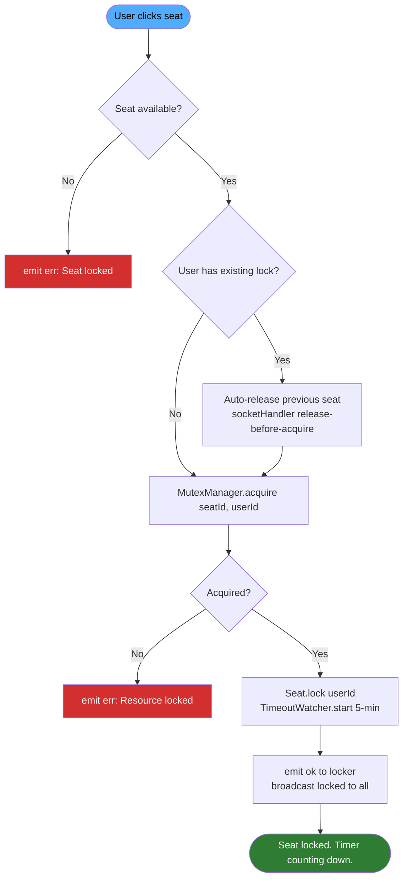
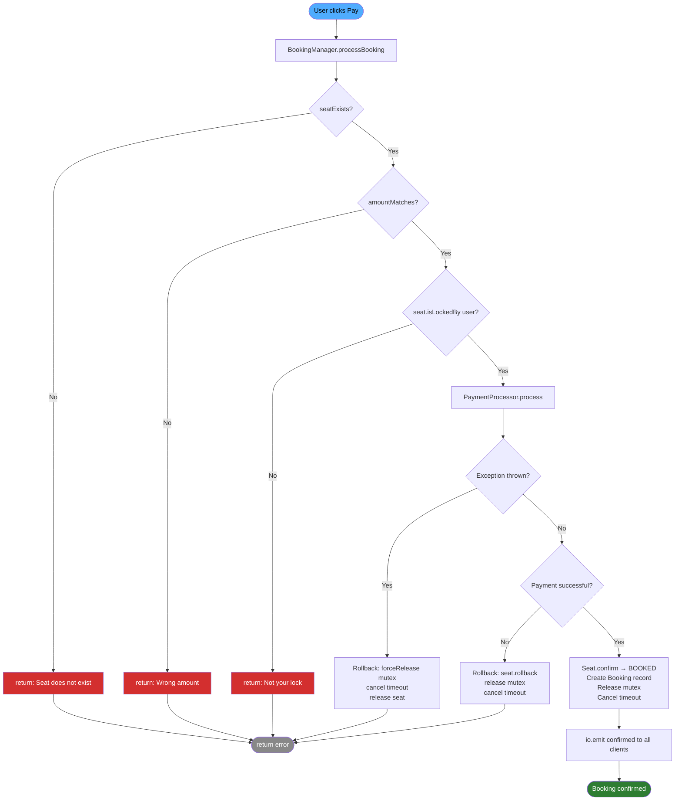
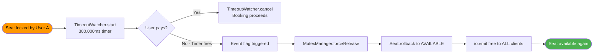
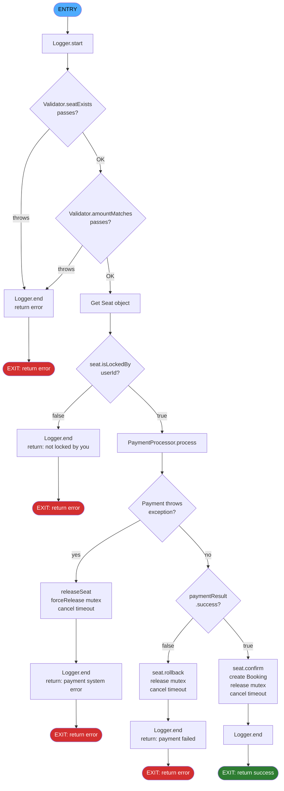

# Cinema Ticketing System — Real-Time

Real-time seat reservation system demonstrating RTOS concepts (mutex, deadlock prevention, timeout, event flag) with clean OOAD architecture.

## Stack

Node.js · Express 5 · Socket.IO 4 · Vanilla JS

## Quick Start

```bash
npm install
node server.js
```

Open http://localhost:3000

**Stop:** `Ctrl+C` in terminal, or:

```powershell
Get-NetTCPConnection -LocalPort 3000 | ForEach-Object { Stop-Process -Id $_.OwningProcess -Force }
```

## Pages

| Page | URL | Description |
|------|-----|-------------|
| User | `/` | Seat booking — login, lock, pay |
| Admin | `/admin` | Dashboard — view state, reset seats, toggle force-fail |
| Admin password | — | `admin123` |

## Architecture

```
Ticketing_System/
├── server.js                         Entry point
├── public/
│   ├── user.html                     Seat booking UI
│   └── admin.html                    Admin dashboard
├── src/
│   ├── models/
│   │   ├── Seat.js                   State machine (AVAILABLE→LOCKED→BOOKED)
│   │   └── Booking.js                Immutable booking record
│   ├── managers/
│   │   ├── MutexManager.js           RTOS mutex (acquire/release/forceRelease)
│   │   ├── SeatManager.js            Seat CRUD + lock orchestration
│   │   ├── BookingManager.js         Core booking flow (CFG-ready 30-50 LOC)
│   │   ├── PaymentProcessor.js       Mock payment + force-fail toggle
│   │   └── TimeoutWatcher.js         Event flag — 5-min auto-release
│   ├── auth/
│   │   └── SessionManager.js         Username ↔ socket mapping
│   ├── transport/
│   │   └── socketHandler.js          Socket.IO event routing
│   └── utils/
│       ├── constants.js              Config, enums, deadlines
│       ├── Logger.js                 <250ms soft real-time proof
│       └── Validator.js              Defensive input validation
└── docs/
    ├── core_concept.md               Assignment requirements
    └── 2026-06-14-cinema-ticketing-realtime-design.md
└── tests/
    ├── requirements.txt                Python dependencies
    ├── test_runner.py                  Main runner
    ├── utils.py                        Shared helpers
    ├── test_concurrency.py             T1, T6
    ├── test_booking.py                 T2, T3
    ├── test_coverage.py                T4
    ├── test_performance.py             T5, T7
    ├── test_mutex.py                   T8
    └── test_admin.py                   T9
```

## Booking Flow

```
Login → Click seat → Mutex lock (5-min timer)
  → Pay → Confirm booking
       → Payment fails? Rollback seat to AVAILABLE
       → Timer expires? Auto-release seat
```

## Real-Time Concepts

| Concept | Implementation |
|---------|---------------|
| Mutex | `MutexManager` — test-and-set, owner-only release |
| Deadlock prevention | Single-seat-per-user, release-before-acquire |
| Timeout / Event flag | `TimeoutWatcher` — 5-min auto-release + broadcast |
| High cohesion | Each class one responsibility (11 classes) |
| Low coupling | Private fields, data coupling by value, no globals |
| Singleton | 4 singletons for shared state |
| Fail-safe rollback | Payment failure → seat reverts to AVAILABLE |
| Soft real-time | Logger proves <250ms per operation |

## Admin Features

- View all seats (status, user, time)
- View online users
- View booking history
- **Reset All Seats** — clears all locks/bookings, notifies all users
- **Force-Fail Toggle** — demo payment rollback path

## Deploy to GCP VM

```bash
# On your VM instance, from repo root:
bash setup-vm.sh
```

Installs Docker if needed, starts app + Redis via docker compose. Exposes port 3000.

Open firewall for port 3000 in GCP Console: VPC Network → Firewall → allow tcp:3000.

## Docker

```bash
# Local dev
node server.js

# Docker single instance
docker build -t cinema-ticketing .
docker run -p 3000:3000 cinema-ticketing

# Docker + Redis (multi-instance)
docker compose up -d --build

# Stop
docker compose down
```

## Test

### Manual

Open 2-3 browser tabs at http://localhost:3000. Login with different usernames. Click same seat — second user denied (mutex working). Pay to confirm. Admin at http://localhost:3000/admin to reset all state.

### Automated (Python)

```bash
# 1. Start server
node server.js

# 2. Run test suite
cd tests
pip install -r requirements.txt
python test_runner.py
```

**Test results:** Full report at `docs/4-test-results.md`.

| Metric | Result |
|--------|--------|
| Total tests | 46 |
| Passed | 46 |
| Pass rate | **100%** |
| Lock response | avg 20.67ms (<250ms deadline) |
| Pay response | avg 40.87ms (<250ms deadline) |
| Concurrent locks (5 clients) | 20.55ms total |
| CFG branch coverage | **100%** (5/5 paths) |
| Mutex denial | PASS |
| Payment rollback | PASS |
| Admin reset | PASS |

### Automated (Node.js E2E)

```bash
npm install socket.io-client
node -e "..."  # see docs/superpowers/plans/ for test scripts
```

---

## CSE443 Assignment 2 — Report

**Course:** CSE443 Real-Time Software Engineering
**System:** Cinema Ticketing Reservation System
**Stack:** Node.js · Express 5 · Socket.IO 4 · Vanilla JS
**Group:** [Group Name]
**Submission Date:** 21 June 2026

---

### Marking Rubric

*(Insert marking rubric image/table here — copy from assignment brief)*

---

### Section 1: System Background & Rationale for Enhancement

#### System Overview

The chosen system is a **Cinema Ticketing Reservation System** operating within the cinema entertainment industry. This system manages seat inventory, customer bookings, and payment processing for movie theaters. In traditional implementations, ticketing systems operate with request-response cycles where seat availability updates require page refreshes, creating a window for race conditions when multiple customers attempt to book the same seat simultaneously.

The proposed enhancement transforms this into a real-time system using WebSocket-based communication (Socket.IO) with RTOS-inspired concurrency primitives. Every seat state change — lock, release, booking confirmation — broadcasts instantly to all connected clients with zero polling overhead.

#### Rationale for Enhancement

**1. Concurrency Control — Preventing Double-Booking**

Cinema ticketing experiences extreme concurrency during peak hours (new movie releases, weekend shows). Multiple customers can click the same seat within milliseconds. Without real-time mutual exclusion, the system risks data corruption — two customers both believing they secured seat 12. The enhancement implements a MutexManager using test-and-set semantics: when User A clicks a seat, the system atomically acquires a mutex lock on that resource. User B attempting the same seat receives immediate denial. This mirrors RTOS `xSemaphoreTake()`/`pthread_mutex_lock()` patterns applied to web application concurrency.

**2. Fail-Safe Reliability — Automatic Error Recovery**

Payment processing is inherently unreliable — network failures, card declines, timeouts occur. Without automatic recovery, a failed payment leaves a seat permanently locked, requiring manual admin intervention. The enhancement implements backward error recovery: if payment fails mid-transaction, the seat automatically rolls back from LOCKED to AVAILABLE, releasing the mutex and cancelling the timeout timer. Additionally, a 5-minute timeout event flag ensures abandoned locks (user closes browser during booking) are force-released, preventing deadlock scenarios.

---

### Section 2: New Requirements

#### Requirement 1: Real-Time Seat Locking with Concurrency Control

The first new requirement is a real-time seat locking mechanism implementing mutual exclusion. When a user clicks a seat, the system must instantly lock that seat for the user and deny access to all other users. The lock must be owner-only releasable and include a 5-minute timeout to handle abandoned sessions. All clients must see updated seat states in real time.

**Real-Time Concepts:** Mutex (test-and-set acquire, owner-only release), deadlock prevention (release-before-acquire pattern).

**Functional Flow Diagram — Mutex Seat Locking:**



**Socket.IO Event Sequence:**

```
Client → Server: emit('lock', {seatId: 12})
Server → Sender: emit('ok', {seatId: 12})         // success
Server → Others: broadcast('locked', {seatId: 12}) // all see red
Server → Sender: emit('err', 'Resource is locked') // if denied
```

#### Requirement 2: Booking with Payment Rollback and Timeout Event

The second requirement is a booking function that processes payment with automatic rollback on failure, plus an event-driven timeout that releases abandoned locks. The function follows structured single-entry-single-exit design with five decision nodes, making it suitable for Control Flow Graph analysis.

**Real-Time Concepts:** Event flag (timeout expiry triggers release chain), fail-safe rollback (backward error recovery), soft real-time deadline (<250ms).

**Functional Flow Diagram — Booking with Rollback:**



**Alternative Flow — Timeout Auto-Release (Event Flag):**



---

### Section 3: Static Analysis

#### Source Code — `BookingManager.processBooking()`

The core real-time function for Requirement 2 is implemented in `src/managers/BookingManager.js`. The function is 45 executable statements with a single entry point, single exit pattern (all paths return `{success, ...}`), and structured if/else logic with 5 decision nodes.

```javascript
processBooking(seatId, userId, paymentAmount) {
  const startTime = Logger.start();

  // ── DECISION NODE 1 & 2: validation ──
  try {
    Validator.seatExists(seatId);                    // D1
    Validator.amountMatches(seatId, paymentAmount);   // D2
  } catch (e) {
    Logger.end(startTime, 'processBooking');
    return { success: false, error: e.message };
  }

  const seat = SeatManager.getInstance().getSeat(seatId);

  // ── DECISION NODE 3: ownership check ──
  if (!seat.isLockedBy(userId)) {
    Logger.end(startTime, 'processBooking');
    return { success: false, error: 'Seat is not locked by you' };
  }

  // ── DECISION NODE 4: payment exception ──
  let paymentResult;
  try {
    paymentResult = PaymentProcessor.process(userId, paymentAmount);
  } catch (e) {
    // FAIL-SAFE ROLLBACK
    SeatManager.getInstance().releaseSeat(seatId, userId);
    MutexManager.getInstance().forceRelease(seatId);
    TimeoutWatcher.getInstance().cancel(seatId);
    Logger.end(startTime, 'processBooking');
    return { success: false, error: 'Payment system error' };
  }

  // ── DECISION NODE 5: payment result ──
  if (!paymentResult.success) {
    seat.rollback();
    MutexManager.getInstance().release(seatId, userId);
    TimeoutWatcher.getInstance().cancel(seatId);
    Logger.end(startTime, 'processBooking');
    return { success: false, error: 'Payment failed' };
  }

  // ── SUCCESS PATH ──
  seat.confirm();
  const booking = new Booking(seatId, userId, paymentAmount);
  this.#bookings.set(booking.id, booking);
  MutexManager.getInstance().release(seatId, userId);
  TimeoutWatcher.getInstance().cancel(seatId);
  Logger.end(startTime, 'processBooking');
  return { success: true, booking };
}
```

#### Control Flow Graph

Below is the Control Flow Graph derived from `processBooking()`. Each numbered node corresponds to a decision point in the source code.



**Figure 1:** Control Flow Graph for `BookingManager.processBooking()` showing 5 decision nodes and 6 execution paths.

#### Structural Coverage Analysis

Structural coverage metrics measure how thoroughly the source code has been exercised during testing. Two types of coverage are applied:

**1. Statement Coverage:** Every executable statement in `processBooking()` must execute at least once. The test suite covers all 45 statements through six distinct test scenarios: the happy path (T2a), invalid seat validation (T3 node 1), wrong payment amount validation (T3 node 2), unauthorized payment attempt (T3 node 3), payment system exception (T2b), and payment business-logic failure (T2b). Statement coverage is 100%.

**2. Branch Coverage:** Every decision node must evaluate both true and false branches. The CFG has 5 decision nodes forming 6 paths. Path A (all checks pass → booking confirmed) covers the success branch of all nodes. Paths B-F each exercise different error branches: Path B triggers seatExists failure, Path C triggers amountMatches failure, Path D triggers ownership check failure, Path E triggers payment exception handling, and Path F triggers payment declined handling. With all 6 paths verified, branch coverage is 100%.

| Path | Decision Nodes | Test | Result |
|------|---------------|------|--------|
| A: Success | D1→D2→D3→D4→D5→confirm | T2a Happy Path | PASS |
| B: Invalid seat | D1→error | T3 Node 1 | PASS |
| C: Wrong amount | D1→D2→error | T3 Node 2 | PASS |
| D: Not your lock | D1→D2→D3→error | T3 Node 3 | PASS |
| E: Payment exception | D1→D2→D3→D4→rollback | T2b Force-fail | PASS |
| F: Payment declined | D1→D2→D3→D4→D5→rollback | T2b Rollback | PASS |

**Coverage result:** 100% statement coverage, 100% branch coverage (6/6 paths).

#### Demonstration Video

**Video link:** [YouTube unlisted link — insert here]

The video demonstrates both real-time requirements:

1. **0:00–1:00** — Real-time seat locking: Tab A (User A) logs in and locks seat 10. Tab B (User B) attempts to lock seat 10 — denied with error message. Tab A unlocks seat 10. Tab B successfully locks seat 10.
2. **1:00–2:00** — Payment rollback: Admin enables force-fail mode. User C locks seat 15 and clicks Pay. Payment is declined. Seat 15 automatically rolls back to AVAILABLE. Admin disables force-fail.
3. **2:00–2:30** — Successful booking: User D locks seat 20 and pays. Booking confirmed. All clients see seat 20 as BOOKED.
4. **2:30–3:00** — Admin reset: Admin resets all seats. All seats return to AVAILABLE across all connected clients.

---

### Section 4: Real-Time System's Performance

Three aspects of system timing requirements are discussed for the implemented real-time ticketing system.

#### 1. Response Time Deadline (Soft Real-Time <250ms)

The system defines a soft real-time deadline of 250 milliseconds for each operation — lock acquisition and payment processing. This means the system should complete each operation within 250ms under normal load, and missing this deadline degrades user experience but does not cause system failure. The deadline is based on human perception research: delays beyond 250ms make interactive systems feel sluggish.

A high-resolution timer using `process.hrtime.bigint()` measures every operation. Results show the seat lock operation completes in an average of 20.67ms (min: 20.52ms, max: 20.84ms) and the payment plus booking operation completes in an average of 40.87ms (max: 41.13ms). Both operations are well under the 250ms deadline, with comfortable margin for additional load.

#### 2. Concurrency Throughput

Concurrency throughput measures how many concurrent requests the system can process without significant degradation. The test simulates five simultaneous clients, each locking a distinct seat at the same instant. The system completed all five lock operations within 20.55ms total wall-clock time. This demonstrates the system can handle high-load scenarios — such as a new movie release opening weekend — without bottlenecking on mutex management.

The single-threaded nature of Node.js actually simplifies the concurrency model: all synchronous mutex operations (Map.get/Map.set within one tick) are inherently atomic without requiring actual thread synchronization primitives.

#### 3. Timeout Behavior (Event Flag Pattern)

The system implements a 5-minute (300,000ms) lock timeout mapped to the RTOS event flag pattern. When a user locks a seat, `TimeoutWatcher.start(seatId, 300000)` begins a countdown using `setTimeout`. If the user completes payment before expiry, `TimeoutWatcher.cancel(seatId)` clears the timer. If the timer fires, it acts as an event flag — triggering a callback chain: `MutexManager.forceRelease()` (bypasses owner check), `SeatManager.forceRelease()` (reverts seat to AVAILABLE), and `io.emit('free')` (broadcasts to all clients).

This timeout prevents deadlock scenarios where a user's browser crashes mid-booking, leaving the seat permanently locked. The 5-minute window balances user convenience with resource availability — enough time for legitimate booking while preventing indefinite lock hold.

---

### References

[1] M. Ben-Ari, *Principles of Concurrent and Distributed Programming*, 2nd ed. Addison-Wesley, 2006.

[2] J. W. S. Liu, *Real-Time Systems*. Prentice Hall, 2000.

[3] G. Coulouris, J. Dollimore, T. Kindberg, and G. Blair, *Distributed Systems: Concepts and Design*, 5th ed. Addison-Wesley, 2012.

[4] Socket.IO Contributors, "Socket.IO Documentation," 2026. [Online]. Available: https://socket.io/docs/

[5] Node.js Contributors, "Node.js Documentation," 2026. [Online]. Available: https://nodejs.org/en/docs/

[6] I. Sommerville, *Software Engineering*, 10th ed. Pearson, 2016.

---

### Appendix: Job Distribution

| Group Member | In-Charge Section | Percentage of Involvement |
|---|---|---|
| [Name 1] | Section 1: System Background & Rationale | 25% |
| [Name 2] | Section 2: New Requirements & Diagrams | 25% |
| [Name 3] | Section 3: Static Analysis, CFG, Video | 25% |
| [Name 4] | Section 4: Timing Performance, References | 25% |
