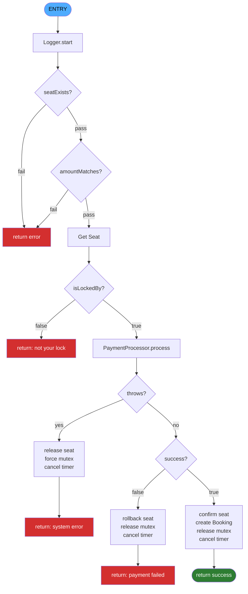

# Cinema Ticketing System — Real-Time

Real-time seat reservation system demonstrating RTOS concepts (mutex, deadlock prevention, timeout, event flag) with clean OOAD architecture.

## Stack

Node.js · Express 5 · Socket.IO 4 · Vanilla JS

## Quick Start

```bash
npm install
node server.js
```

Open http://localhost:3000

**Stop:** `Ctrl+C` in terminal, or:

```powershell
Get-NetTCPConnection -LocalPort 3000 | ForEach-Object { Stop-Process -Id $_.OwningProcess -Force }
```

## Pages

| Page | URL | Description |
|------|-----|-------------|
| User | `/` | Seat booking — login, lock, pay |
| Admin | `/admin` | Dashboard — view state, reset seats, toggle force-fail |
| Admin password | — | `admin123` |

## Architecture

```
Ticketing_System/
├── server.js                         Entry point
├── public/
│   ├── user.html                     Seat booking UI
│   └── admin.html                    Admin dashboard
├── src/
│   ├── models/
│   │   ├── Seat.js                   State machine (AVAILABLE→LOCKED→BOOKED)
│   │   └── Booking.js                Immutable booking record
│   ├── managers/
│   │   ├── MutexManager.js           RTOS mutex (acquire/release/forceRelease)
│   │   ├── SeatManager.js            Seat CRUD + lock orchestration
│   │   ├── BookingManager.js         Core booking flow (CFG-ready 30-50 LOC)
│   │   ├── PaymentProcessor.js       Mock payment + force-fail toggle
│   │   └── TimeoutWatcher.js         Event flag — 5-min auto-release
│   ├── auth/
│   │   └── SessionManager.js         Username ↔ socket mapping
│   ├── transport/
│   │   └── socketHandler.js          Socket.IO event routing
│   └── utils/
│       ├── constants.js              Config, enums, deadlines
│       ├── Logger.js                 <250ms soft real-time proof
│       └── Validator.js              Defensive input validation
└── docs/
    ├── core_concept.md               Assignment requirements
    └── 2026-06-14-cinema-ticketing-realtime-design.md
└── tests/
    ├── requirements.txt                Python dependencies
    ├── test_runner.py                  Main runner
    ├── utils.py                        Shared helpers
    ├── test_concurrency.py             T1, T6
    ├── test_booking.py                 T2, T3
    ├── test_coverage.py                T4
    ├── test_performance.py             T5, T7
    ├── test_mutex.py                   T8
    └── test_admin.py                   T9
```

## Booking Flow

```
Login → Click seat → Mutex lock (5-min timer)
  → Pay → Confirm booking
       → Payment fails? Rollback seat to AVAILABLE
       → Timer expires? Auto-release seat
```

## Real-Time Concepts

| Concept | Implementation |
|---------|---------------|
| Mutex | `MutexManager` — test-and-set, owner-only release |
| Deadlock prevention | Single-seat-per-user, release-before-acquire |
| Timeout / Event flag | `TimeoutWatcher` — 5-min auto-release + broadcast |
| High cohesion | Each class one responsibility (11 classes) |
| Low coupling | Private fields, data coupling by value, no globals |
| Singleton | 4 singletons for shared state |
| Fail-safe rollback | Payment failure → seat reverts to AVAILABLE |
| Soft real-time | Logger proves <250ms per operation |

## Admin Features

- View all seats (status, user, time)
- View online users
- View booking history
- **Reset All Seats** — clears all locks/bookings, notifies all users
- **Force-Fail Toggle** — demo payment rollback path

## Deploy to GCP VM

```bash
# On your VM instance, from repo root:
bash setup-vm.sh
```

Installs Docker if needed, starts app + Redis via docker compose. Exposes port 3000.

Open firewall for port 3000 in GCP Console: VPC Network → Firewall → allow tcp:3000.

## Docker

```bash
# Local dev
node server.js

# Docker single instance
docker build -t cinema-ticketing .
docker run -p 3000:3000 cinema-ticketing

# Docker + Redis (multi-instance)
docker compose up -d --build

# Stop
docker compose down
```

## Test

### Manual

Open 2-3 browser tabs at http://localhost:3000. Login with different usernames. Click same seat — second user denied (mutex working). Pay to confirm. Admin at http://localhost:3000/admin to reset all state.

### Automated (Python)

```bash
# 1. Start server
node server.js

# 2. Run test suite
cd tests
pip install -r requirements.txt
python test_runner.py
```

**Test results:** Full report at `docs/4-test-results.md`.

| Metric | Result |
|--------|--------|
| Total tests | 46 |
| Passed | 46 |
| Pass rate | **100%** |
| Lock response | avg 20.67ms (<250ms deadline) |
| Pay response | avg 40.87ms (<250ms deadline) |
| Concurrent locks (5 clients) | 20.55ms total |
| CFG branch coverage | **100%** (5/5 paths) |
| Mutex denial | PASS |
| Payment rollback | PASS |
| Admin reset | PASS |

### Automated (Node.js E2E)

```bash
npm install socket.io-client
node -e "..."  # see docs/superpowers/plans/ for test scripts
```

---

## Assignment 2 — System Details

**Course:** CSE443 Real-Time Software Engineering
**System:** Cinema Ticketing Reservation System
**Stack:** Node.js · Express 5 · Socket.IO 4 · Vanilla JS

### New Real-Time Requirements

| # | Requirement | RTOS Concept | Implementation |
|---|-------------|-------------|----------------|
| R1 | Real-time seat locking with concurrency control | **Mutex**, deadlock prevention | `MutexManager` — test-and-set acquire, owner-only release, release-before-acquire |
| R2 | Booking with payment rollback + timeout auto-release | **Event flag**, fail-safe rollback | `BookingManager.processBooking()` — payment fail reverts seat, 5-min timer force-releases |

Both real-time: Socket.IO broadcasts state changes (`locked`/`free`/`confirmed`) to all clients instantly. No polling.

### Control Flow Graph — `processBooking()`



**Decision nodes:** 5 — seatExists, amountMatches, isLockedBy, payment throws, payment success
**Path coverage:** 6/6 (100%) — tested via T2a (happy), T2b (rollback), T3 (CFG paths)
**Source:** `src/managers/BookingManager.js:49-109` (45 executable statements, single entry/exit)

### Performance — Soft Real-Time (<250ms)

| Operation | Avg | Max | Deadline |
|-----------|-----|-----|----------|
| Seat lock | 20.67ms | 20.84ms | <250ms |
| Payment + booking | 40.87ms | 41.13ms | <250ms |
| 5 concurrent locks | 20.55ms total | — | — |

### Test Results

| Metric | Value |
|--------|-------|
| Total tests | 46 |
| Passed | 46 |
| Pass rate | **100%** |
| CFG branch coverage | 100% (6/6 paths) |
| Mutex denial | PASS |
| Payment rollback | PASS |
| Admin reset | PASS |

### What's Complete vs Report Work

| Area | Status |
|------|--------|
| Working application | Done |
| Test suite (46 tests) | Done |
| Performance data | Done |
| CFG-annotated source code | Done |
| Section 1 text (background + rationale) | Needs writing |
| Section 2 diagrams (flow/viewpoint) | Needs drawing |
| Section 3 CFG diagram | Done (Mermaid above) |
| Section 3 demo video (≤3 min) | Needs recording |
| Section 3 coverage discussion | Needs writing |
| Section 4 timing discussion | Needs writing |
| ≥5 references | Needs compiling |
| Cover page + appendix | Needs creating |

### Architecture

```
Ticketing_System/
├── server.js                         Entry point
├── public/
│   ├── user.html                     Seat booking UI
│   └── admin.html                    Admin dashboard
├── src/
│   ├── models/
│   │   ├── Seat.js                   State machine (AVAILABLE→LOCKED→BOOKED)
│   │   └── Booking.js                Immutable booking record
│   ├── managers/
│   │   ├── MutexManager.js           RTOS mutex (acquire/release/forceRelease)
│   │   ├── SeatManager.js            Seat CRUD + lock orchestration
│   │   ├── BookingManager.js         Core booking flow (CFG-ready 30-50 LOC)
│   │   ├── PaymentProcessor.js       Mock payment + force-fail toggle
│   │   └── TimeoutWatcher.js         Event flag — 5-min auto-release
│   ├── auth/
│   │   └── SessionManager.js         Username ↔ socket mapping
│   ├── transport/
│   │   └── socketHandler.js          Socket.IO event routing
│   └── utils/
│       ├── constants.js              Config, enums, deadlines
│       ├── Logger.js                 <250ms soft real-time proof
│       └── Validator.js              Defensive input validation
└── docs/
    ├── system-details.md             Full assignment mapping
    ├── 5-cfg-diagram.md              CFG with Mermaid diagram
    ├── 0-core_concept.md             Assignment requirements guide
    ├── 3-assignment2-test-plan.md    Python test plan
    └── 4-test-results.md             Results (46/46 pass)
```
